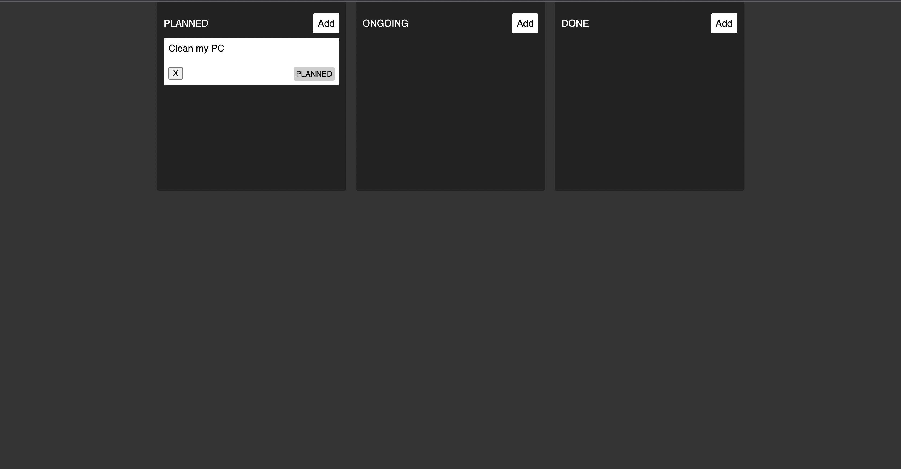
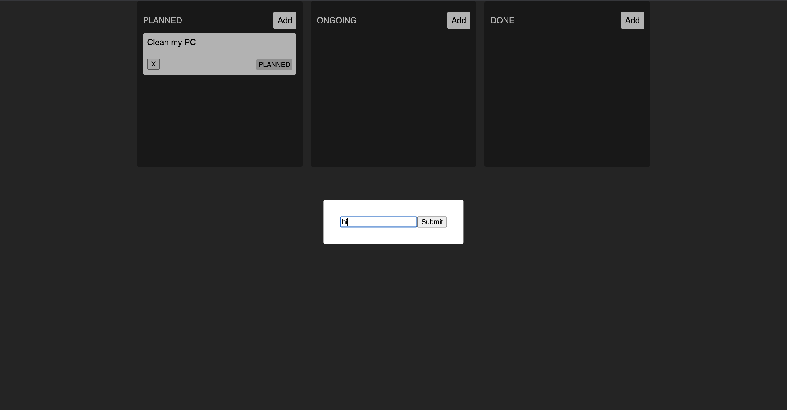
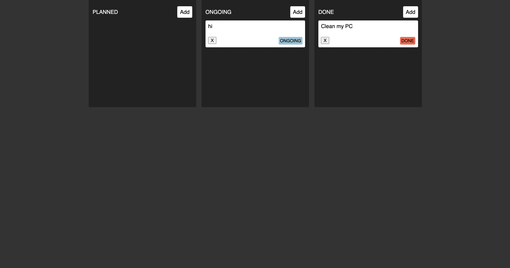

## Kaban (Zustand state Management)

[Zustand](https://docs.pmnd.rs/zustand/getting-started/introduction) has less boilerplate code compared to [Redux](https://redux-toolkit.js.org/)

[Test Link](https://kaban-zustan.vercel.app)

[dylut2000 Twitter](https://twitter.com/dylut2000)

[dylut2000 Github](https://github.com/dylut2000)
